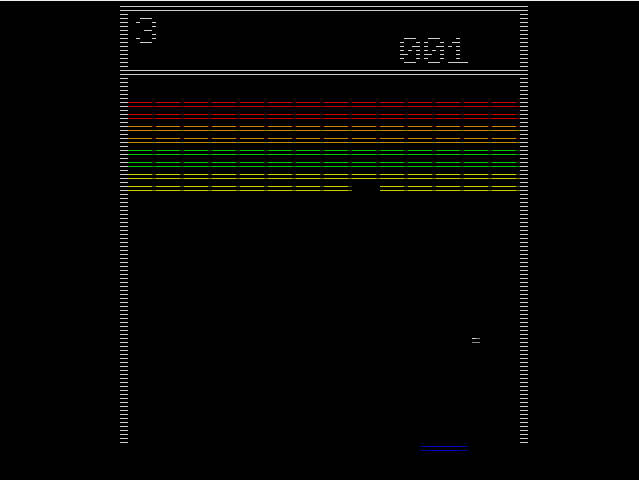
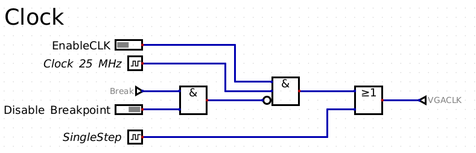
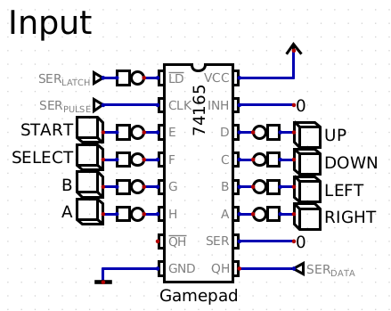
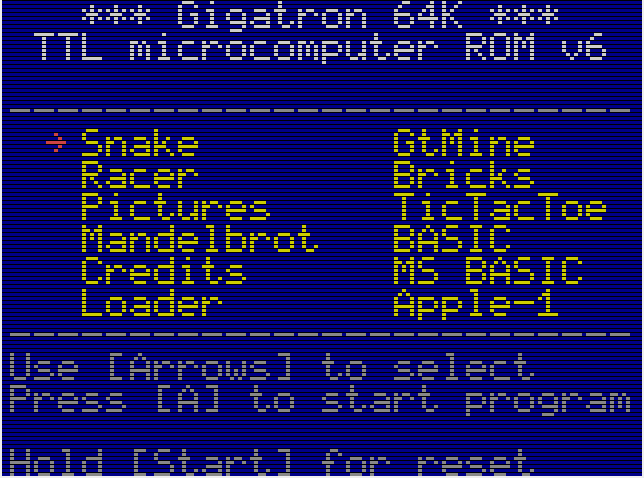

# Overview
This is an implementation of the gigatron TTL computer which is a computer based on TTL chips.
The design was based on the schematic of the gigatron, but there were some modifications needed to support simulation and verilog export.

# Usage
Get the program Digital and install it as described here:
[Digital at github](https://github.com/hneemann/Digital)

The simulation can be started by the following steps:
* Start the program Digital.
* Open the file gigatron.dig.
* Press play button to start the simulation.

* Click on EnableCLK. The CPU is now running and takes some time until the window with the VGA output is opened.

* You can control it via the buttons of the gamepad. Click on the SELECT button and hold for some seconds. This will change the resolution. Release the SELECT button for some seconds. Repeat that until you have more black on the screen. More black lines will make it faster.

* With the buttons for UP/DOWN/LEFT/RIGHT you can select an menu entry and A will start it.
The simulation is pretty slow.

# Debugging
There are some break points implemented which can be controlled via Digital.
* BreakAddr: Program pointer where to stop, this triggers already when the previous instruction is still executed. ProgramBreakEnable enables the breakpoint.
* X Reg Value: Only break at program pointer when the X register has the configued value. RegXBreakEnable enables that.
* WriteBreakAddr: Break when the configured RAM address is written.
When a breakpoint is hit, the clock should be disabled by EnableCLK. Then you can single step.
* SingleStep: First EnableCLK needs to be disabled. VGA clock is controlled by SingleStep; i.e. you need to click multiple times to get CLK1 and CLK2 changes.
After single step you can enable the clock again. SingleStep must be low.

# Tracing
There is a Trace Memory which contains each address which was executed (16 bit address). It first need to be enabled via "Trace Enable" DIP switch. The output "Trace End Address" contains the last address in "Trace Memory" which was written. You can open a memory dump by clicking on the "Trace Memory". You have to go backwards from the last address to see how it got there. The values after the end address are old, because it is a ring buffer.

# Explanation of instruction set
The gigatron has an unique instruction set which is very simple, but it is complicated to understand it and write code. It has a ROM (EEPROM) and can only execute instructions from that. This cannot be changed at runtime in real hardware (the simulator can).
The code is also responsible for bitbanging the VGA lines which makes it more complicated for software developers.
The ROM emulates a 6502 cpu. The code for the emulated 6502 cpu is stored in RAM which can be changed.

# Design Changes
There were some design changes needed to get it working in the simulation and getting verilog export working. The changes are:
* Verilog export does not support multiple sources driving the same line (e.g. BUS). The components were replaced by logic gates.
* BUS is handled via AND gates and the output is selected via control lines ~DE, ~IE, ~AE and ~OE.
 Diodes were replaced by AND gates.
* The simulated VGA output requires the pixel clock (25 MHz). All clocks are derived from that.
* CLK1 is 1/4 of the VGA clock. Same for CLK2, but with a delay.
* SRAM: ~WE depends also on CLK2. RAM is written when CLK1 goes low and CLK2 is not yet high. CLK2 high may increment the X register and the RAM address would be wrong (e.g. instruction "st $59,[y,x++]").
* Instruction "ctrl y,x" causes ~WE and ~OE to be low at the same time. This is unstable and Digital cannot calculate that. ~WE and ~OE is forced to high under that condition.
verilog export is supported via gigatroncpu.dig.

# ROM Problems
It seems that 6502 BRK instruction is not correctly implemented in ROMv6. Trace has shown that instruction at 0x10ff is executed when v6502\_BRK is called. This looks like a bug in the ROM code (v6). It is not know whether this has an side effect. All 6502 instructions seem to have a problem with the branch delay slot. For v6502\_SED it has most likely a side effect as Y register is modified.

# Altera Cyclone II FPGA Starter Kit
There is an Altera quartus project for the DE1 board, but the ROM access is too slow.
Flash has only 8 bit data klines connected, so 2 accesses are needed for reading the instruction (2 * 70 ns required).
The file AlterCycloneIIFPGAStarterBoardSetup/output\_files/setupboardmem.sof can be loaded to the FPGA on the DE1 board.
The VGA timing is not correct. There is a VGA driver which converts it,
but it has to buffer it and the memory is limited on the Cyclone II.
So only the first line with characters can be displayed.
The switches can be used to configure the board:

| Switch  | Purpose
|---------|--------------------------------------------
|   SW[9] | Enable clock -> ON
| SW[8:5] | Configure clock frequency
|   SW[4] | unused
| SW[3:0] | Configure displayed value on 7 segment LEDs

| SW[8:5] | Frequency | CPU       | ROM Access time
|---------|-----------|-----------|----------------
|    0000 | 2.98 Hz   | 0.42 Hz   | 335 ms
|    0001 | 12.5 MHz  | 1.785 MHz | 80 ns
|    0010 | 8.333 MHz | 1.19 MHz  | 120 ns
|    0011 | 6.25 MHz  | 0.89 MHz  | 160 ns
|    0100 | 5 MHz     | 0.714 MHz | 200 ns
|    0101 | 4.166 MHz | 0.595 MHz | 240 ns
|    0110 | 3.571 MHz | 0.510 MHz | 280 ns
|    0111 | 3.125 MHz | 0.446 MHz | 320 ns
|    1000 | 2.777 MHz | 0.397 MHz | 360 ns
|    1001 | 2.5 MHz   | 0.357 MHz | 400 ns
|    1010 | 2.273 MHz | 0.325 MHz | 440 ns
|    1011 | 2.083 MHz | 0.298 MHz | 480 ns
|    1100 | 1.923 MHz | 0.275 MHz | 520 ns
|    1101 | 1.786 MHz | 0.255 MHz | 560 ns
|    1110 | 1.667 MHz | 0.238 MHz | 600 ns
|    1111 | 1.563 MHz | 0.223 MHz | 640 ns

| SW[3:0] | Displayed value
|---------|-------------------------------------------
|    0000 | ROM address (instruction pointer)
|    0001 | Value read from ROM
|    0010 | Instruction register and data register
|    0011 | Accumulator register
|    0100 | X register
|    0101 | Y register
|    0110 | OUT register
|    0111 | value on BUS
|    1000 | Value calculated by ALU
|    1001 | Bit 8: IE\_N
|         | Input value
|    1010 | SRAM address, DEAD when larger than 16 bit
|    1011 | Value read/written from/to SRAM
|    1100 | EXOUT value
|    1101 | Bit 0 SRAM\_OE\_N
|         | Bit 1 SRAM\_OE\_N
|         | Bit 2 SRAM\_OE\_N requested by cpu
|         | Bit 8 SRAM\_WE\_N
|         | Bit 9 SRAM\_WE\_N request by cpu
|    1110 | Bit 0: reset\_n
|         | Bit 1: clk1
|         | Bit 2: clk2
|         | 2 bit clk\_counter
|    1111 | rom\_counter
|         | Bit 4: insn\_ready

The green LEDs are EXOUT; i.e. 0 to 3 are also on the gigatron TTL board.

# Source of Files
Some files were taken from Digital/src/main/dig/lib/DIL Chips/74xx/plexers/74138.dig (git https://github.com/hneemann/Digital.git 535812dacb7c34f125f8033b37db84bdb17bda4b), but include some fixes.
74138ndelay.dig is a copy of Digital/src/main/dig/lib/DIL Chips/74xx/plexers/74138.dig, but delay was removed, because this cannot be converted to verilog.
74244fixed.dig is a copy of Digital/src/main/dig/lib/DIL Chips/74xx/driver/74244.dig, but the ~ sign was moved to the first character, because this cannot be handled in verilog code.
